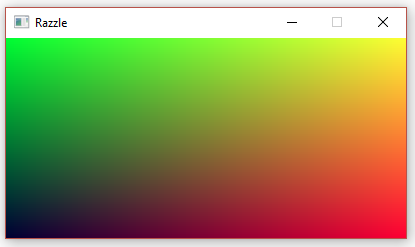

Razzle
======

A small ppm reader written in Rust!

To run this program, invoke `cargo run "<the-path-to-your-ppm-file>"`. 

Be sure to use quotes if you have spaces in your path.

# Features
- parse and view PPMs that are `P3` compliant
- upscaling by a constant factor, taken as a command line argument

# Screenshots
Here's `Razzle` in action:

